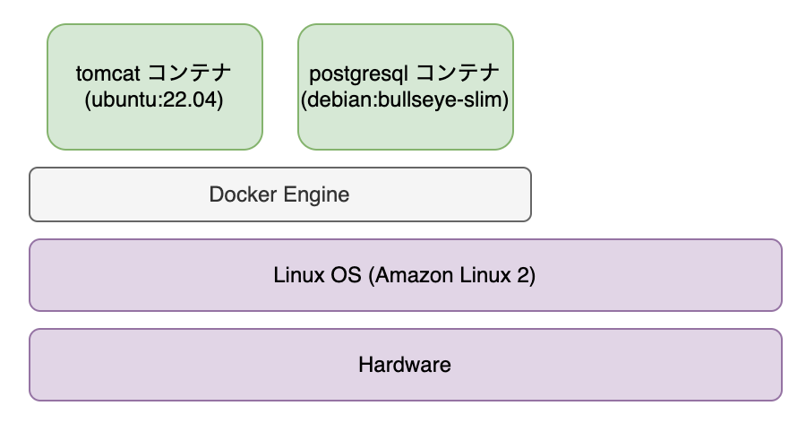

## 1. Docker 概説

### Docker とは
Docker とは Linux OS 上でコンテナ仮想化を行うためのユーティリティです。  
Linux OS 上で 複数の独立した Linux システム (コンテナ) を実行することができます。

コンテナごとに独立した環境で動くため、ちょっとした仮想マシンのようなものと思えるかもしれません。

例えば以下の図のように Amazon Linux 2 上で Ubuntu や Debian ベースのコンテナを動かすことができます。

コンテナは OS を動かすというよりは上の図のように何らかのアプリケーションやコマンドプロセスの実行を行うのが普通です。  
ただ、コンテナはアプリケーションだけでなくその実行環境を含めて構成されます。
最初にコンテナを Linux システムと言ったのはこのためです。

### コンテナ image
(「イメージ」という用語は一般語と衝突するため image と表記します。)

コンテナは「コンテナ image」(以下 image) を元に生成されます。

image というのはコンテナのテンプレートのようなものです。

image とコンテナの関係はプログラムの実行ファイルと実際に実行されているプログラムの関係に似ています。  
前者はファイルシステム上に静的に保存されている一方、後者はメモリ上に存在します。

また、(Docker) image は Dockerfile と呼ばれる image の構成ファイルから作成されます。  
image をプログラムの実行ファイルと思えば、Dockerfile はソースコードに相当します。

### Docker を使うメリット
- アプリケーションの実行環境とホスト OS の環境を分離できる
  - 例えば tomcat を動かすためには Java のランタイム (JRE) が必要ですが、これは tomcat コンテナに含まれるためホスト OS に JRE をインストールする必要がありません
- スケールが容易
  - 複数のサーバーでアプリケーションコンテナを実行するのに image を配布するだけですみます
- アプリケーションの実行環境をテキストファイルとして管理ができる
  - 環境を Dockerfile に書き下すことで環境構築の手続きをコードとして管理できます

### 次章以降の内容
これから docker を使って、コンテナの生成削除といったコンテナの扱い方や、Dockerfile の書き方、またここでは登場しませんでしたが docker-compose という複数のコンテナを連携して実行するツールの使い方を学んでいきます。

### 参考文献
- https://docs.docker.com/get-started/
- https://wiki.archlinux.jp/index.php/Linux_Containers
