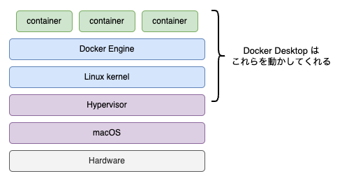

## 2. Docker Desktop インストール

### Docker Desktop とは
第一章で Docker とは Linux 上でコンテナ仮想化を行うためのツールだと説明しました。従って macOS や Windows 上で Docker を使うためには Linux の仮想環境が必要になります。Docker Desktop は macOS, Windows 向けに Linux の仮想環境を含めたコンテナの実行環境とその他便利なユーティリティを提供するアプリケーションです。Docker Desktop は Docker Engine の実行に必要となる Linux の仮想環境の存在をユーザーが意識しなくても使えるよう作られているため、macOS や Windows 上で直接コンテナを実行しているような感覚で使うことができます。



### Docker Desktop インストール
#### macOS
以下のリンクからインストーラーを入手できます。  
[https://docs.docker.com/desktop/mac/install/]()

また、Homebrew を使ってインストールすることもでできます。
```
$ brew install --cask docker
```

#### Windows
だれかかいてー