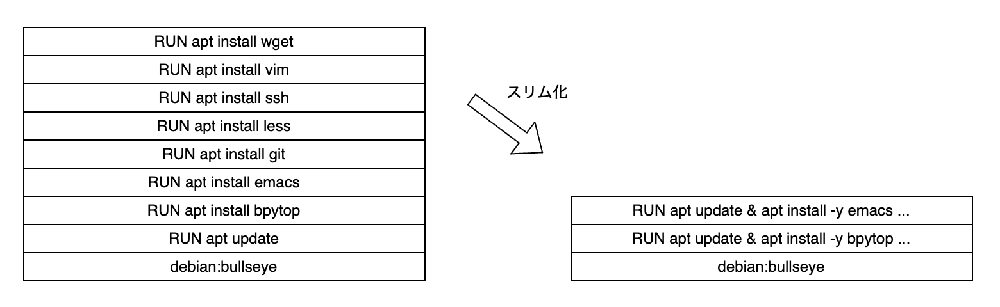

## 4. Dockerfile の書き方

### debian image のカスタマイズ
#### bpytop のインストール
まず前章を踏まえて、`bpytop` がインストールされた debian image を作ってみましょう。

適当なディレクトリ (ここでは mydebian/ とします) を用意し、その中に `Dockerfile` というファイル名で以下の内容のファイルを作成して下さい。

```Dockerfile
FROM debian:bullseye

RUN apt update
RUN apt install -y bpytop
```

Dockerfile の内容は以下の様になっています。

1. まず `FROM` でベースとなる image を指定します
2. `RUN` でコマンドを実行できます
    - apt update コマンドを使ってパッケージ一覧を更新します
    - apt install コマンドで `bpytop` をインストールします

Dockerfile は上のように `FROM` 命令から始まるのが基本です。
`FROM` 命令でベースの image を指定し、`RUN` を始めとする Dockerfile の命令コマンドを使ってカスタマイズしていきます。

Dokcerfile をもとに image を作成しましょう。
次のコマンドを実行して下さい。(// の部分はコマンドの説明コメントです)
```
$ docker build ./mydebian -t mydebian
// docker build <Dockerfile のあるディレクトリのパス> -t <image_tag>
```

`mydebian` (正確には `mydebian:latest`) という名前の image が作成されます。
以下のコマンドで image の一覧を取得できるので確認してみましょう。
```
$ docker image ls
```

`mydebian` image をもとにコンテナを作成し `bpytop` コマンドを実行してみます。
```
$ docker run -it --rm mydebian bpytop
```

実行できたかと思います。

このようにコンテナをカスタマイズしたい場合は Dockerfile を書いて image を自作します。

#### 色々インストール
`bpytop` だけではつまらないので、他のツールもインストールしてみましょう。

以下をインストールします。
- vim
- emacs
- git
- less
- wget
- ssh

そのために先程の Dockerfile を編集して以下のようにします。

```Dockerfile
FROM debian:bullseye

RUN apt update && apt install -y \
  bpytop \
  && rm -rf /var/lib/apt/lists/*

RUN apt update && apt install -y \
  emacs \
  git \
  less \
  ssh \
  vim \
  wget \
  && rm -rf /var/lib/apt/lists/*
```

先ほどとは少し書き方を変えています。  
Dockerfile の書き方にはベストプラクティスが存在します。`RUN` 命令をコマンドごとに繰り返さずひとまとめにするなどがそうです。今回の記述スタイルはベストプラクティスに沿ったやり方になっていますが、なぜそうするべきかについて以下で説明していきます。

image は Dockerfile 命令コマンドの積み重ねで作成されていきます。
このとき 1 つの命令コマンドごとに変更が差分適用されていきます。命令コマンドの実行は git の commit ようなイメージです。この image の差分をレイヤーと呼びます。
一般に命令コマンドが増えて image のレイヤーが増えていくほど image サイズが大きくなっていきます。
image サイズが増えると可搬性が悪くなったりコンテナの起動が遅くなるため、できる限り image サイズは小さくするべきです。
とはいえ全てのコマンドをひとまとめにするのにも問題があります。image はレイヤー単位でキャッシュされるため、全てをひとまとめにしてしまうと Dockerfile の一部に変更を加えたときに `docker build` コマンドはそのレイヤー全てを作り直すことになってしまいます。単純に Dockerfile 読みづらくなるという問題もあります。
そのため Dockerfile はある程度のまとまりで命令コマンドをまとめるとよいでしょう。


また、パッケージのインストールでは命令コマンドごとに最初にパッケージ一覧の更新 (`apt update`) をして、最後にキャッシュを削除 (`rm -rf /var/lib/apt/lists/*`) をしましょう。
先述の通り image はレイヤー単位でキャッシュされるため `apt update` と `apt install` が別々のレイヤーにある場合、`apt update` が実行されるタイミングと `apt install` が実行されるタイミングがずっと離れてしまう可能性があります。パッケージのキャッシュ削除は image サイズ抑制のためです。

Dockerfile のベストプラクティスについての詳細は参考文献の "Dockerfile_Best_Parctices" を参照して下さい。

さて、変更した Dockerfile をもとに再び image をビルドし、新たに作成されたコンテナで先ほどインストールしたコマンド群が利用できることを確認してみましょう。
```
$ docker build ./mydebian -t mydebian
$ docker run -it --rm mydebian
```

#### 起動コマンドの変更
ところで debian:bullseye コンテナの起動コマンドは `bash` でした。`docker run` でコマンドを指定しなければ `bash` が実行されるのはそのためです。
ここでは起動コマンドを `bash` から `zsh` に変えてみましょう。

Dockerfile を以下のように変更、あるいは必要な部分を追記します。
```Dockerfile
FROM debian:bullseye

RUN apt update && apt install -y \
  zsh \
  && rm -rf /var/lib/apt/lists/*

CMD ["zsh"]
```
`zsh` をインストールしたあとで `CMD` 命令コマンドを指定しています。
この `CMD` 命令コマンドによって起動コマンドを指定することができます。

ビルドし、コンテナを立ち上げます。
```
$ docker build ./mydebian -t mydebian
$ docker run -it --rm mydebian
```

このとき `zsh` が実行されています。以下のコマンドを実行するとシェルの名前が表示されるので確認してみましょう。
```
// コンテナ内
$ echo $0
```

### nginx コンテナで静的ページを表示する
この節では前の節で説明しなかった `COPY` 命令コマンドを使って nginx コンテナで静的ページを表示する例を紹介します。  
実用上、目的にあった image と `COPY` の組み合わせはとてもよく現れるパターンです。

#### Nginx コンテナの実行

まずは素の nginx コンテナを起動してみましょう。
```
$ docker run -it --rm -p 8080:80 nginx:latest
```
ブラウザから [http://localhost:8080]() または [http://0.0.0.0:8080]() にアクセスすると nginx のデフォルトページが表示されます。

`-p 8080:80` というのは、外部に 8080 番ポートを公開しコンテナネットワーク内の 80 番ポートにフォワーディングせよという意味のオプションです。コンテナは (指定しなければ) docker が自動で作成するコンテナネットワーク内に置かれますが、これはホスト OS のネットワークと分離されています。そのため公開するポートを指定しなければアクセスできません。
nginx はコンテナ内で 80 番ポートを使用しているので、内側は 80 番ポートを指定する必要があります。

#### 表示する HTML を変更

さて、Dockerfile をカスタマイズすることで、nginx のデフォルトページではなく自作の html を表示してみましょう。

まずは html ファイルを用意します。`mynginx/html` というディレクトリを作ってその中に `index.html` というファイルを作ります。
以下はファイル内容の例です。
```html
<html lang="en">
<head>
  <title>Sample page</title>
</head>
<body>
  <h1>Sample page</h1>
  <p>This is a sample.</p>
</body>
</html>
```

そして、`mynginx/` に以下の内容の `Dockerfile` を用意します。

```Dockerfile
FROM nginx:1.23
COPY html /usr/share/nginx/html
```

`COPY` 命令コマンドでローカルの `html` ディレクトリを image 内の `/usr/share/nginx/html` ディレクトリにコピーしています。

また今回は `nginx:latest` ではなく `nginx:1.23` とタグによってバージョンを指定しています。ビルドのタイミングによって作成される image が変わってしまう可能性があるため、image のバーションは明示することを推奨します。

ビルドし、実行してみましょう。
```
$ docker build ./mynginx -t mynginx
$ docker run -it --rm -p 8080:80 mynginx
```
用意した html が表示されるはずです。

ところで `docker build` コマンドで指定したディレクトリ (上では `./mynginx`) は Dockerfile のある場所を示すと説明しましたが、これは正確でありません。指定したディレクトリはビルドコンテキストと呼ばれ、これは `Dockerfile` 内で `COPY` などを使ってローカルのファイルやディレクトリを指定する際のベースパスを示すものです。加えて `docker build` コマンドにおいて Dockerfile を指定しなかった場合はビルドコンテキスト内の `Dockerfile` という名前のファイルをビルド対象に指定したことになります。

Dockerfile を明示的に指定する場合は以下のようになります。
```
$ docker build ./mynginx -f ./mynginx/Dockerfile -t mynginx
```

### 参考文献
- [Dockerfile_Best_Practices](https://docs.docker.com/develop/develop-images/dockerfile_best-practices/)
- https://www.guri2o1667.work/entry/2020/11/30/%E3%80%90docker%E3%80%91%E3%83%93%E3%83%AB%E3%83%89%E3%82%B3%E3%83%B3%E3%83%86%E3%82%AD%E3%82%B9%E3%83%88%EF%BC%88build_context%EF%BC%89%E3%81%A8%E3%81%AF%EF%BC%9F