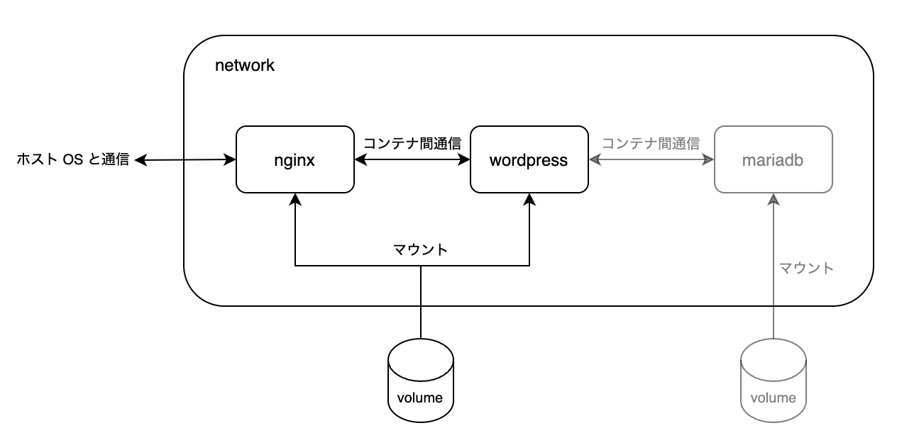
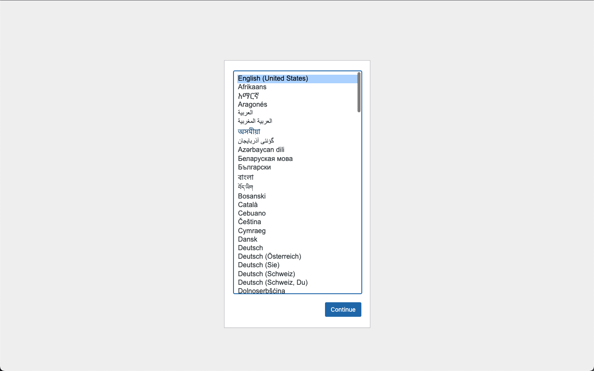

## 5. 複数のコンテナを組み合わせる

### 複数のコンテナを組み合わせる
今までは単一のコンテナを動かしていましたが、ここでは複数のコンテナを組み合わせて動かしてみましょう。
具体的には、前章で触れた nginx と wordpress のコンテナを使い Wordpress をホストします。
Wordpress は PHP で書かれたアプリケーションで、それ自体は Web サーバーとしての機能がありません。nginx などの Web サーバーと組み合わせることで HTTP リクエストを受けつけることができるようになります。詳細にはたち入りませんが詳しく知りたい場合は PHP-FPM で調べて下さい。

#### 全体構成
構成は以下のようになります。



network と volume という概念が出てきました。順番に説明します。  
network とは前章でも少し触れましたが、コンテナネットワークというホストのネットワークから独立したコンテナ用のネットワークです。コンテナネットワークは指定しなければコンテナごとに独立して作成されます。今回 nginx コンテナと wordpress コンテナは互いに通信する必要があるため、ネットワークが分かれていると困ります。そのため 2
 つのコンテナが共存するネットワークを明示的に作成します。  
volume というのは名前の通りで、データの記憶領域のことです。コンテナにマウントして永続的な記憶領域として利用したり、複数のコンテナにマウントしてデータを共有できます。今回 wordpress のコンテナ内にある静的ファイル (css, js など) を nginx でホストするために nginx コンテナから読めるようにする必要があったため、ファイル共有目的で使用しています。
volume についての今回の対応はあまり本質的でないので軽く読み飛ばして問題ありません。

#### wordpress コンテナの作成
さて、さっそく構築していきましょう。
まずはネットワークとボリュームを作成しておきます。
```
$ docker network create wp-network
$ docker volume create wp-volume
```
ネットワーク名、ボリューム名を指定するとそれぞれ作成されます。名前はわかりやすいものをつければ良いです。

次に wordpress コンテナを作成しましょう。
```
$ docker run -d -it --rm --name mywordpress --network wp-network --mount source=wp-volume,target=/var/www/html wordpress:php8.1-fpm
```
まず、`--network wp-network` でネットワークを指定しています。これによって、このコンテナは `wp-network` に所属します。  
また `--mount source=wp-volume,target=/var/www/html` によってボリューム `wp-volume` を mywordpress コンテナの `/var/www/html` にマウントしています。  
ボリュームのマウントでは基本的に target が source に置き換わります (target に元々あったものが消えます) が、source が空の場合は逆に target の内容が source にコピーされます。
`wp-volume` は先ほど作成したばかりの空のボリュームなので、今回は mywordpress コンテナの `/var/www/html` の内容が `wp-volume` にコピーされる形になります。

#### nginx コンテナの作成
wordpress コンテナが立ち上がったはいいものの、このままではアクセスできないのでした。

まず `mywp/` というディレクトリを作ります。今回必要なものはここにまとめることにします。

nginx が wordpress コンテナと通信できるよう設定ファイルを作成します。  
`mywp/nginx/conf.d/wordpress.conf` を以下の内容でディレクトリ含め作成してください。
```
server {
  listen 80;
  server_name localhost;

  access_log  /dev/stdout main;
  error_log   /dev/stderr warn;
  rewrite_log on;

  root   /var/www/html;
  index index.php index.html;

  location / {
    try_files $uri $uri/ /index.php$is_args$args;
  }

  location ~ \.php$ {
    fastcgi_split_path_info  ^(.+\.php)(\.+)$;
    fastcgi_intercept_errors on;
    fastcgi_index  index.php;
    fastcgi_pass   mywordpress:9000;
    include        fastcgi_params;
    fastcgi_param  SCRIPT_FILENAME  $document_root$fastcgi_script_name;
    fastcgi_param  PATH_INFO $fastcgi_path_info;
  }

  location ~* \.(css|js|gif|ico|jpeg|jpg|png)$ {
    root /usr/share/nginx/html;
  }
}
```
中身を理解する必要はありませんが `fastcgi_pass` の部分でコンテナ名とポート番号を指定している点だけ注目しておきましょう。同一のコンテナネットワークであればネットワークホスト名としてコンテナ名を指定することができます。

nginx 用の Dockerfile を `mywp/Dockerfile` として作成します。
```Dockerfile
FROM nginx:1.23
RUN rm /etc/nginx/conf.d/default.conf
COPY nginx/conf.d /etc/nginx/conf.d
```
デフォルトの設定を捨てて、先ほど書いた設定ファイルをコピーしています。

ビルドしてコンテナを立ち上げましょう。
```
$ docker build ./mywp -t mynginx

$ docker run -d -it --rm --name mynginx --network wp-network --mount source=wp-volume,target=/usr/share/nginx/html -p 8080:80 mynginx
```
ネットワークの指定は良いでしょう。mywordpress コンテナと同一のネットワークを指定しています。  
ボリュームのマウントについては、`wp-volume` には mywordpress コンテナの静的ファイル群がコピーされていましたが、それらを nginx コンテナ内にマウントしています。

#### 動作確認
一旦コンテナが正常に立ち上がっているか確認しましょう。
```
$ docker ps
CONTAINER ID   IMAGE                  COMMAND                  CREATED       STATUS       PORTS                  NAMES
0dda7e3206ff   mynginx                "/docker-entrypoint.…"   3 hours ago   Up 3 hours   0.0.0.0:8080->80/tcp   mynginx
9c22e41d5a21   wordpress:php8.1-fpm   "docker-entrypoint.s…"   3 hours ago   Up 3 hours   9000/tcp               mywordpress
```
mynginx と mywordpress の 2 つのコンテナが存在するはずです。

ここまででようやく画面が表示されるようになります。  
http://localhost:8080 にアクセスしてみましょう。



上の画面が表示されれば OK です。

ところでこの先に進もうとするとデータベースの接続設定を求められます。  
というわけでデータベースコンテナを用意しましょう、といきたいわけですがそろそろ状況が複雑になってきました。

実を言うと複数のコンテナをまとめて管理するためのツールとして docker-compose というものが存在します。次章では docker-compose を導入し、この章で行ったことを再現します。そうして状況を整理した上で先に進むことにしましょう。


### 参考文献
- https://qiita.com/aki_55p/items/db706d0113cbdad6c51d