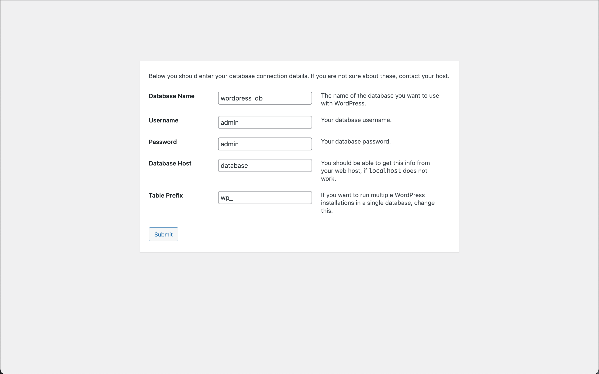
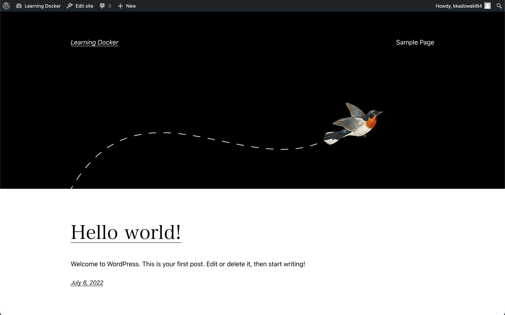

## 6. docker-compose の使い方

前章で予告したとおり、前章の内容を docker-compose を使ってやり直すところから始めたいのですが、その前にまず docker-compose とは、なにかについて簡単に説明します。

### Docker Compose
Docker Compose とは複数のコンテナを定義し実行する Docker アプリケーションのためのツールです (と公式に書いてある)。複数のコンテナの実行に関する設定をまとめることができます。コンテナのまとまりごとに環境を分離することができ、単一のホスト上で複数の環境 (コンテナのまとまり) を実行することもできます。

Docker Desktop は Docker Compose を含んでいるので、追加のインストールなしで使うことができます。
`docker compose` または `docker-compose` コマンドがそれです。どちらのコマンドも利用できますが `docker compose` の方が新しく、`docker-compose` コマンドを `docker` のサブコマンドとして書き直したものになります。

複数のコンテナを実行・管理するツールをコンテナオーケストレーションツール、あるいはコンテナオーケストレーターといいます。Docker Compose もその一つです。コンテナオーケストレーターには他にも Docker Swarm, Kubernetes などがあります。これらはネットワーク上にある複数のノード (マシン) 上でコンテナを実行することができます。一方 Docker Compose は単一ホストで使用するツールです。そのため本番環境というよりはローカルでの開発環境の構築のために主に利用されることが多いです。

### 前章の再現 (1/2)
さっそく前章の再現をしていきます。
前と同様に wordpress コンテナから動かしてみましょう。

コンテナの実行に関する設定、とやらは YAML ファイルで書きます。天下り的ですが以下のようにファイルを作成して下さい。

`mywp/docker-compose.yml`
```
version: "3"

networks:
  wp-network:

volumes:
  wp-resources:

services:
  wordpress:
    image: wordpress:php8.1-fpm
    volumes:
      - type: volume
        source: wp-resources
        target: /var/www/html
    networks:
      - wp-network
```
一番最初の `version` というのは設定ファイル (Compose ファイル) 形式のバージョンです。バージョンによって扱える設定項目が異なります。3 を指定した場合は 3.0 を指定したことになります。

`networks`, `volumes` はそれぞれネットワークとボリュームの定義です。存在しなければ新規に作成されます。

`services` がメインで、ここにコンテナの設定を書いていきます。今回まずは wordpress のコンテナのみを動かすので設定は一つだけです。サービス名を `wordpress` としています (これはコンテナ名とは異なります)。
`docker run` コマンドを使ったときと比較するとわかりやすいでしょう。
イメージの指定、ボリュームのマウントなど、コマンドでの指定の仕方と見比べて YAML ファイルの書き方を確認しましょう。
```
$ docker run -d -it --rm --name mywordpress --network wp-network --mount source=wp-volume,target=/var/www/html wordpress:php8.1-fpm
```

さっそく実行しましょう、`docker-compose.yml` ファイルのある `mywp/` ディレクトリに移動してください。
その後で以下のコマンドを実行します。
```
$ docker compose up
```
ログが流れ、wordpress コンテナが実行されているらしいことがわかります。

ログを見てみると `mywp_wp-network` という名前のネットワークが作成されたり、`mywp_wordpress_1` という名前のコンテナが作成されていることが読み取れます。docker-compose はリソース名の前にプレフィックスとしてディレクトリ名を付与するなどしてくれます。そのため、先ほどサービス名として `wordpress` という名前を付けましたが、このように汎用的な名前をつけても問題が起きません。

`docker compose up` コマンドを実行すると、そのディレクトリにある `docker-compose.yml` という名前のファイルが Compose ファイルとして読み込まれます。`docker-compose.yml` というファイル名にしたのはこのような理由からです。明示的に指定するには `-f` オプションを使います。
```
$ docker compose -f docker-compose.yml up
```

`C-c` で停止します。

コマンドの紹介のためにもう一度、次は以下のコマンドで実行します。
```
$ docker compose up -d
```
こうすると実行したあとにデタッチしてバックグラウンドで動作します。

この場合ログは
```
$ docker compose logs
```
で確認できます。

最後に、以下のコマンドでコンテナ群を停止・破棄できます。
```
$ docker compose down
```
このとき Compose ファイルで定義したネットワークも破棄されます。  
ボリュームは破棄されません。

`docker compose stop` でコンテナを破棄せず停止することもできますが、あまり使いません。

### 前章の再現 (2/2)
引き続き前章の復元をしていきます。

Dockerfile や nginx の設定は前章のものを使いまわします。

`mywp/docker-compose.yml` を次のように書き換えます。
```
version: "3"

networks:
  wp-network:

volumes:
  wp-resources:

services:
  nginx:
    build:
      context: .
      dockerfile: Dockerfile
    volumes:
      - type: volume
        source: wp-resources
        target: /usr/share/nginx/html
    ports:
      - "8080:80"
    depends_on:
      - wordpress
    networks:
      - wp-network

  wordpress:
    image: wordpress:php8.1-fpm
    volumes:
      - type: volume
        source: wp-resources
        target: /var/www/html
    networks:
      - wp-network
```
変わったのは services/nginx の部分です。nginx は image をカスタマイズして使っていたので wordpress とは異なり `build` オプションを使っています。ビルドコンテキストと Dockerfile を相対パスで指定しています。
`docker` コマンドのとき比較と比較しましょう。
```
$ docker run -d -it --rm --name mynginx --network wp-network --mount source=wp-volume,target=/usr/share/nginx/html -p 8080:80 mynginx
```
`build` 以外では `depends_on` が気になります。これはコンテナの立ち上げ潤に関する指定です。サービス名を指定すると、そのサービスよりあとに立ち上がります。従って nginx コンテナは wordpress コンテナの後に立ち上がるということです。このようにしないと nginx は接続先を見つけられなくなってしまいます。またボリュームのマウント順も重要なのでした。

ところでこのままでは動きません。nginx の接続先とやらが変わっているためです。  
次のように修正します。  
`mywp/nginx/conf.d/wordpress.conf`
```diff
     fastcgi_index  index.php;
-    fastcgi_pass   mywordpress:9000;
+    fastcgi_pass   wordpress:9000;
     include        fastcgi_params;
```
docker-compose を使う場合、ホスト名としてサービス名を指定できます。コンテナ名は docker-compose が mywp_wordpress_1 などとサービス名をアレンジして付けてくれますが、例えばディレクトリを変えるとコンテナ名も変わってしまいます。サービス名を指定すればそのような変更を心配する必要はありません。

さて実行します。
```
$ docker compose up -d
```
実行すると image のビルドも自動で行われます。

http://localhost:8080 にアクセスしてみましょう。前章と同様の画面が表示されたでしょうか。

### データベースコンテナの追加
ようやく先に進むことができます。

データベースコンテナを追加するために Compose ファイルを編集しましょう。  
Wordpress は MySQL 系の RDBMS をサポートしています。今回は MariaDB を使うことにします。

`mywp/docker-compose.yml`
```
version: "3"

networks:
  wp-network:

volumes:
  wp-resources:
  wp-database:

services:
  nginx:
    # (略)

  wordpress:
    # (略)

  database:
    image: mariadb:10.7
    restart: always
    volumes:
      - type: volume
        source: wp-database
        target: /var/lib/mysql
    environment:
      MARIADB_ALLOW_EMPTY_ROOT_PASSWORD: yes
      MARIADB_DATABASE: wordpress_db
      MARIADB_USER: admin
      MARIADB_PASSWORD: admin
    networks:
      - wp-network
```
restart と environment が気になるところでしょうか。

`restart: always` はコンテナが落ちた場合などに自動で再度起動しなおすための設定です。mariadb コンテナは初期化時に何度か再起動の必要があり、この設定がないと再起動時にコンテナが終了したまま復帰しなくなってしまいます。

`environment:` ではコンテナの環境変数を設定できます。mariadb コンテナはデータベースの初期設定を環境変数で受け付けます。
最初に作成されるデータベースやユーザーの設定をここで行っています。

さて、これでようやくちゃんと動くようになります。  
環境を立ち上げて、Wordpress の設定を完了しましょう。



.  
.  
.



ヤッター、ウレシイ！これで完了です。


### 参考文献
- https://docs.docker.jp/compose/overview.html
- https://junchang1031.hatenablog.com/entry/2016/05/18/000605